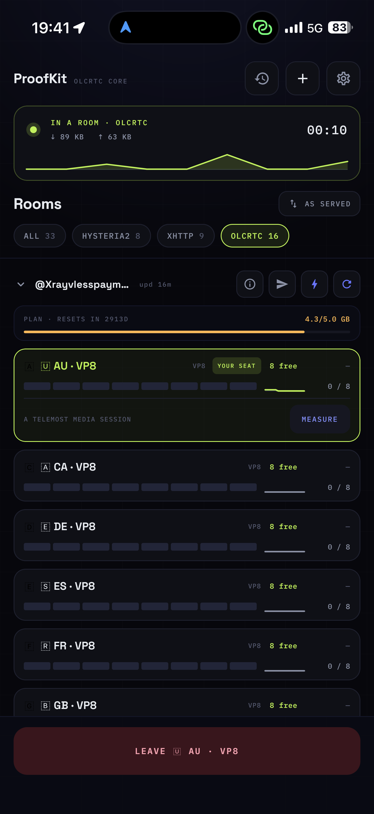
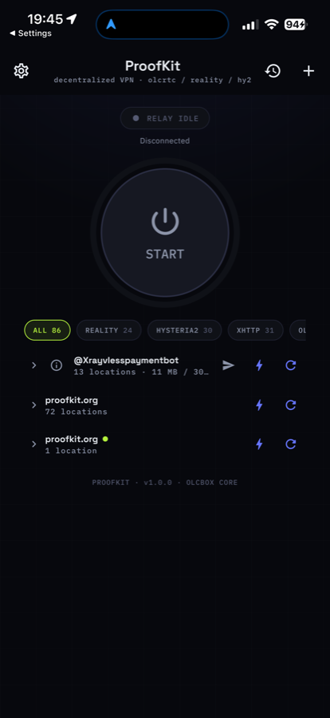
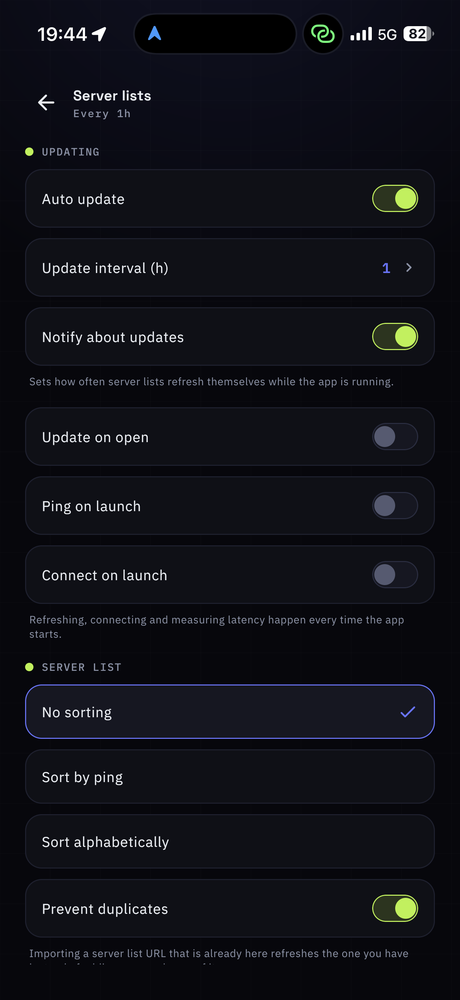
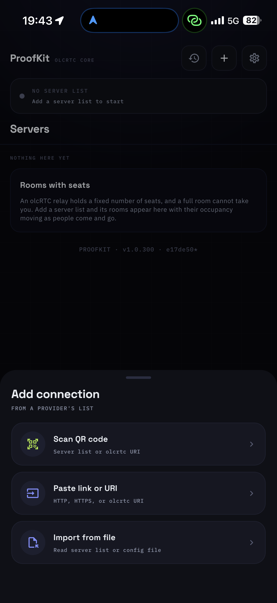

# Olcbox

A VPN client for a subscription you already have. Kotlin Multiplatform and
Compose, one codebase for Android, iOS, macOS, Windows and Linux.

It is a client, not a service: you bring a subscription link from your
provider, and the app turns it into a list of servers you can connect to.
There is no account and nothing to sign up for.

<p align="center">
  
  
  
  
</p>

## Protocols

| Protocol | Engine |
| --- | --- |
| VLESS + Reality | sing-box |
| VLESS over TLS, incl. behind a CDN | sing-box |
| Hysteria2, with Salamander obfuscation | sing-box |
| XHTTP | Xray, behind sing-box's tun |
| olcRTC | our own transport, riding inside a video call |

One subscription usually carries several. The app groups them by provider,
filters by protocol, and remembers the exit last used.

## Status

Shipping. iOS is distributed through the App Store; every other platform is
built by the release workflow and published on the Releases page.

## Credits

A fork of [alananisimov/olcbox](https://github.com/alananisimov/olcbox), which
is where the Kotlin Multiplatform configurator this grew out of came from. The
iOS packet tunnel, the sing-box and Xray transports, and the current interface
were added here; the original copyright stands alongside ours in `LICENSE`, as
MIT requires and as it should.

## Support

Support options are not publicly listed. Contact the author if needed.

> **Автор ничего не продаёт.
> Не продаются приложение, доступ, конфигурации, подписки или услуги поддержки.
> Возможен только добровольный донат.**

## Legal Notice
This software is intended for development, testing and research purposes only.

The author does not provide any guarantees regarding:
- availability of network access
- compatibility with specific services
- compliance with any external restrictions

Users are solely responsible for how they use this software and must comply with applicable laws.

## Usage Restrictions
This software is not intended to be used for bypassing access restrictions or violating applicable laws.
The author does not support or encourage such use.

## Features
- One tap to connect, with the session's elapsed time and traffic on screen.
- Subscriptions by link, QR code or file; grouped, foldable, and refreshed on
  a schedule you choose.
- What the provider says about your plan — quota, expiry, its own support and
  web links — read from the subscription's own headers.
- Latency where it can honestly be measured: through the tunnel for the
  connection you are on, ICMP for a server you are not connected to.
- Sorting by ping or name, filtering by protocol, duplicate subscriptions
  refreshed rather than added twice.
- Diagnostics log with export, and a failed connection that says why.
- Android TUN/proxy modes, SOCKS5 credentials, split tunneling.
- Network migration, reconnect handling, and watchdog recovery.
- No account, no analytics, nothing collected.

## Platform Matrix

| Platform | Modes | Runtime |
| --- | --- | --- |
| Android | TUN, proxy | `VpnService`, `hev-socks5-tunnel`, local `olcrtc` SOCKS5 |
| iOS | System VPN | `NEPacketTunnelProvider`; sing-box, Xray and olcRTC bound into one framework inside the extension |
| macOS | Proxy | local `olcrtc` SOCKS5 with OS PAC settings |
| Windows | TUN | local `olcrtc` SOCKS5, `hev-socks5-tunnel`, Wintun |
| Linux | TUN | local `olcrtc` SOCKS5, `hev-socks5-tunnel`, policy routes |

## Requirements

| Area | Requirement |
| --- | --- |
| JVM | JDK 17+ |
| Android | Android Studio, Android SDK, Android NDK |
| Desktop native assets | Go and local `olcrtc` fork |
| Linux TUN | `iproute2`, `/dev/net/tun`, root/Polkit/sudo privileges |
| Windows TUN | UAC elevation when TUN starts and bundled Wintun runtime |

Default local `olcrtc` path:

```text
../olcrtc
```

Override it with `OLCRTC_REPO`:

```bash
OLCRTC_REPO=/path/to/olcrtc ./gradlew :desktopApp:run
```

Relative `OLCRTC_REPO` values are resolved from the `olcbox` project root:

```bash
OLCRTC_REPO=../olcrtc-ansible-deploy/olcrtc ./gradlew :androidApp:assembleRelease
```

```powershell
$env:OLCRTC_REPO="C:\path\to\olcrtc"
.\gradlew.bat :desktopApp:run
```

## Commands

| Task | Command |
| --- | --- |
| Android debug APK | `./gradlew :androidApp:assembleDebug` |
| Install Android debug APK | `./gradlew :androidApp:installDebug` |
| iOS simulator app | `xcodebuild -project iosApp/iosApp.xcodeproj -scheme iosApp -sdk iphonesimulator -configuration Debug build` |
| Run desktop app | `./gradlew :desktopApp:run` |
| Run desktop app with hot reload | `./gradlew :desktopApp:hotRun --auto` |
| Build desktop native assets | `./gradlew :desktopApp:buildDesktopNativeAssets` |
| Package current host OS | `./gradlew :desktopApp:packageReleaseDistributionForCurrentOS` |
| Main checks | `./gradlew :sharedUI:jvmTest :desktopApp:compileKotlin :androidApp:assembleDebug` |
| JVM tests | `./gradlew :sharedUI:jvmTest` |

## Build Outputs

| Target | Command | Output |
| --- | --- | --- |
| Android debug | `./gradlew :androidApp:assembleDebug` | `androidApp/build/outputs/apk/debug/androidApp-debug.apk` |
| Android release | `./gradlew :androidApp:assembleRelease` | `androidApp/build/outputs/apk/release/androidApp-release.apk` |
| iOS simulator | `xcodebuild -project iosApp/iosApp.xcodeproj -scheme iosApp -sdk iphonesimulator -configuration Debug build` | Xcode DerivedData app product |
| macOS DMG | `./gradlew :desktopApp:packageReleaseDmg` | `desktopApp/build/compose/binaries/main-release/dmg/Olcbox-1.0.0.dmg` |
| Windows EXE | `.\gradlew.bat :desktopApp:packageReleaseExe` | `desktopApp\build\compose\binaries\main-release\exe\Olcbox-1.0.0.exe` |
| Windows MSI | `.\gradlew.bat :desktopApp:packageReleaseMsi` | `desktopApp\build\compose\binaries\main-release\msi\Olcbox-1.0.0.msi` |
| Linux AppImage | `./gradlew :desktopApp:packageReleaseLinuxAppImage` | `desktopApp/build/compose/binaries/main-release/appimage/Olcbox-1.0.0-amd64.AppImage` |

## Native Assets

| Asset | Path |
| --- | --- |
| macOS `olcrtc` | `desktopApp/build/generated/desktopNativeResources/native/olcrtc-darwin-arm64` |
| Linux `olcrtc` | `desktopApp/build/generated/desktopNativeResources/native/olcrtc-linux-amd64` |
| Linux `olcrtc` ARM | `desktopApp/build/generated/desktopNativeResources/native/olcrtc-linux-arm64` |
| Windows `olcrtc` | `desktopApp/build/generated/desktopNativeResources/native/olcrtc-windows-amd64.exe` |
| Linux `hev-socks5-tunnel` | `desktopApp/build/generated/desktopNativeResources/native/hev-socks5-tunnel-linux-amd64` |
| Linux `hev-socks5-tunnel` ARM | `desktopApp/build/generated/desktopNativeResources/native/hev-socks5-tunnel-linux-arm64` |
| Windows `hev-socks5-tunnel` | `desktopApp/build/generated/desktopNativeResources/native/hev-socks5-tunnel-windows-amd64.exe` |
| Windows Wintun runtime | `desktopApp/build/generated/desktopNativeResources/native/wintun.dll` |

## Notes

- Android native ABIs: `armeabi-v7a`, `arm64-v8a`, `x86_64`.
- Android release builds require `keystore.properties` in the repository root.
- macOS DMG output is not notarized unless signing/notarization is configured separately.
- Windows installers must be built on Windows with `jpackage` and WiX available.
- Linux TUN interface: `olcbox0`.
- Linux stop removes policy routes and reverts `systemd-resolved` settings when `resolvectl` is available.

`keystore.properties`:

```properties
storeFile=/absolute/path/to/release.keystore
storePassword=...
keyAlias=...
keyPassword=...
```

Linux privilege override:

Linux privilege override:

```bash
OLCBOX_LINUX_PRIVILEGE=sudo ./gradlew :desktopApp:run
OLCBOX_LINUX_PRIVILEGE=pkexec ./gradlew :desktopApp:run
```
